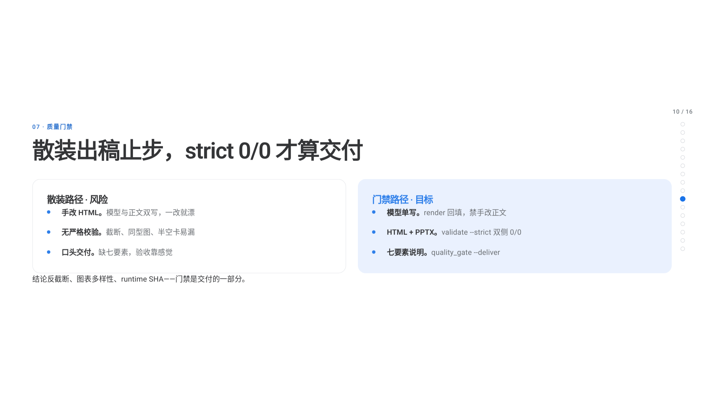

# tms-skills

**[中文](./README.md)** | English

> Language note: **Chinese is the default** (`README.md`). This file is the full English parallel.

[](https://github.com/topmindspace/tms-skills/releases)
[](https://www.npmjs.com/package/@topmindspace/tms-skills)
[](https://github.com/topmindspace/tms-skills/actions/workflows/ci.yml)
[](LICENSE)

**TopMindspace agent-skills monorepo** — turn good ideas into stage-ready deliverables.

Primary skill **[top-ppt-html](./top-ppt-html/)**: elegant, atmospheric **presentation decks** for formal occasions (single-file HTML + layout-faithful editable PPTX).

> Let ideas fly — make good thinking visible.

<p align="center">
  
</p>

> **Warning**: do not install `@topmindspace/tms-skills@^2` (2.0.0–2.1.1 deprecated). Current line is **0.1.x** (`latest`).

## Craft at a glance

### Theme overviews (Gate 0)

<p align="center">
  <br/>
  <sub>Presentation · business-blue</sub>
</p>

<p align="center">
  <br/>
  <sub>Research · mckinsey</sub>
</p>

<p align="center">
  <br/>
  <sub>Architecture · graphite-dark</sub>
</p>

### Style covers

| Presentation · business-blue | Research · mckinsey | Architecture · graphite-dark |
|:---:|:---:|:---:|
|  |  |  |

### Product showcase (Mode A · multi-chart · header toolbar)

| Cover | Three modes | Quality gates | Header toolbar |
|:---:|:---:|:---:|:---:|
|  |  |  |  |

**Live**

- Landing: [topmindspace.github.io/tms-skills/](https://topmindspace.github.io/tms-skills/)
- Full deck: [showcase.html](https://topmindspace.github.io/tms-skills/showcase.html)
- Style gallery: [style-gallery.html](https://topmindspace.github.io/tms-skills/style-gallery.html)
- In-repo gallery: [top-ppt-html/assets/style-gallery.html](./top-ppt-html/assets/style-gallery.html)
- Showcase HTML: [top-ppt-html/assets/examples/2026-09-26-topmind-tms-skills-showcase.html](./top-ppt-html/assets/examples/2026-09-26-topmind-tms-skills-showcase.html)
- More shots: [docs/showcase/](./docs/showcase/)

### HTML header toolbar (ready when you open the file)

| Control | Shortcut | Behavior |
|---------|----------|----------|
| Theme toggle | **T** | Light / dark; per-file memory; syncs `REPORT_MODEL.theme` |
| Style picker | 9 styles | Live visual skins; write back `REPORT_MODEL.style` before deliver |
| PPTX preview | **P** | WYSIWYG page sequence + copyable agent prompt |
| Generation guide | **H** | Dual-channel + environment notes |
| Fullscreen | **F** | Immersive present mode |
| Collapse toolbar | **B** | Mini bar (brand + expand); remembers per file |

See [top-ppt-html/README.md](./top-ppt-html/README.md) and [SKILL.md](./top-ppt-html/SKILL.md).

## Skills

| Skill | Version | What it does |
|-------|---------|--------------|
| [`top-ppt-html`](./top-ppt-html/) | **0.1.10** | Formal presentation decks: paginated HTML + editable 16:9 PPTX; 3 modes × 9 styles; strict 0/0 gates |

Installer [`@topmindspace/tms-skills`](https://www.npmjs.com/package/@topmindspace/tms-skills) is also **0.1.10** (whole-repo same-tag releases).

## Install

**npm = pinned snapshot**; **GitHub = track repo HEAD**.

```bash
npx @topmindspace/tms-skills list
npx @topmindspace/tms-skills install top-ppt-html
npx @topmindspace/tms-skills install top-ppt-html --to ./.claude/skills
npx @topmindspace/tms-skills@0.1.10 install top-ppt-html   # pin
```

```bash
# track HEAD
npx github:topmindspace/tms-skills install top-ppt-html
```

Default probe order: `./.agents` → `./.claude` → `./.cursor` → `./.codex` → `./.mimocode`, then user-level `~/.claude`, etc. Or pass `--to`. Do not `npm install top-ppt-html` (skill id is not a standalone package).

PPTX export needs `npm install` in the skill folder (pptxgenjs). HTML generation uses Python stdlib only.

## Golden examples

| Mode | File |
|------|------|
| A Presentation | [`2026-09-09-presentation-business-blue`](./top-ppt-html/assets/examples/2026-09-09-presentation-business-blue.html) |
| B Research | [`2026-09-09-research-mckinsey`](./top-ppt-html/assets/examples/2026-09-09-research-mckinsey.html) |
| C Architecture | [`2026-09-09-architecture-graphite-dark`](./top-ppt-html/assets/examples/2026-09-09-architecture-graphite-dark.html) |
| Product showcase | [`2026-09-26-topmind-tms-skills-showcase`](./top-ppt-html/assets/examples/2026-09-26-topmind-tms-skills-showcase.html) (5 chart types · toolbar page) |

## Repo layout

```
tms-skills/
├─ top-ppt-html/             # skill (SKILL.md + assets + references + scripts)
├─ bin/tms-skills.js         # CLI: list / install
├─ docs/                     # publishing · showcase shots · banner · Pages source
├─ scripts/                  # repo gates / privacy scan
├─ package.json              # @topmindspace/tms-skills
└─ LICENSE · CHANGELOG.md · README.md · README.en.md
```

## Release & CI

| Action | GitHub | npm |
|--------|:------:|:---:|
| push main | live | **unchanged** |
| tag `vX.Y.Z` | Release + zip | **auto publish** |

```bash
npm run check && npm run audit && npm run privacy
# PPTX smoke (incl. McKinsey): bash scripts/ci_skill_gates.sh --with-pptx
```

See [docs/PUBLISHING.md](./docs/PUBLISHING.md) · [docs/ci.md](./docs/ci.md).

## License

MIT © TopMindspace — [LICENSE](./LICENSE)
