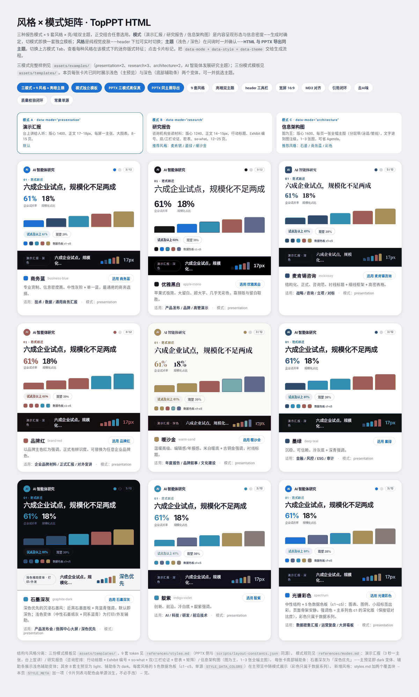
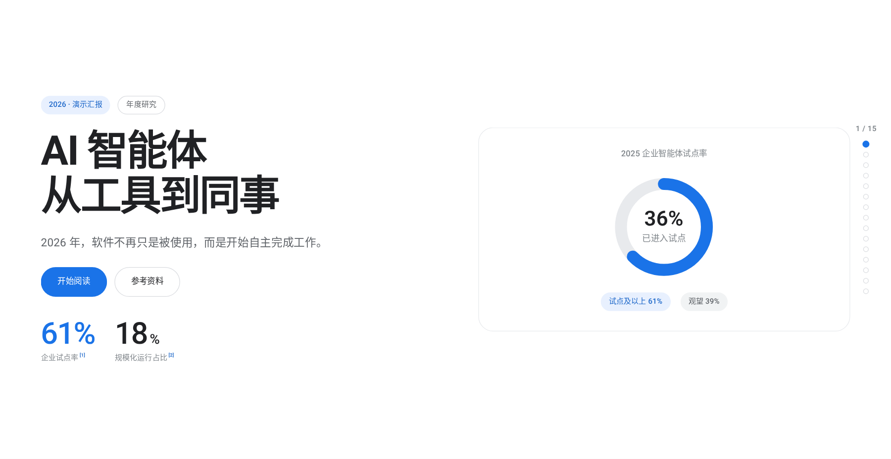
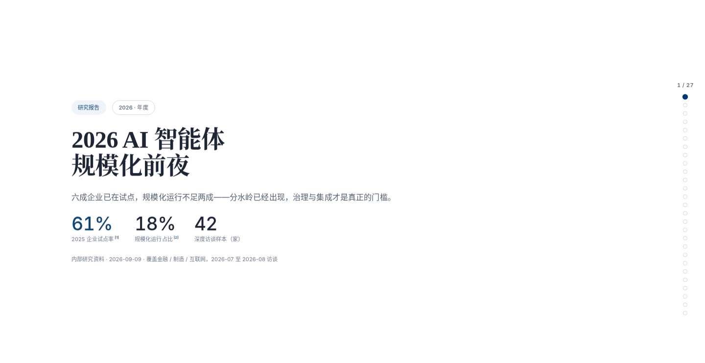
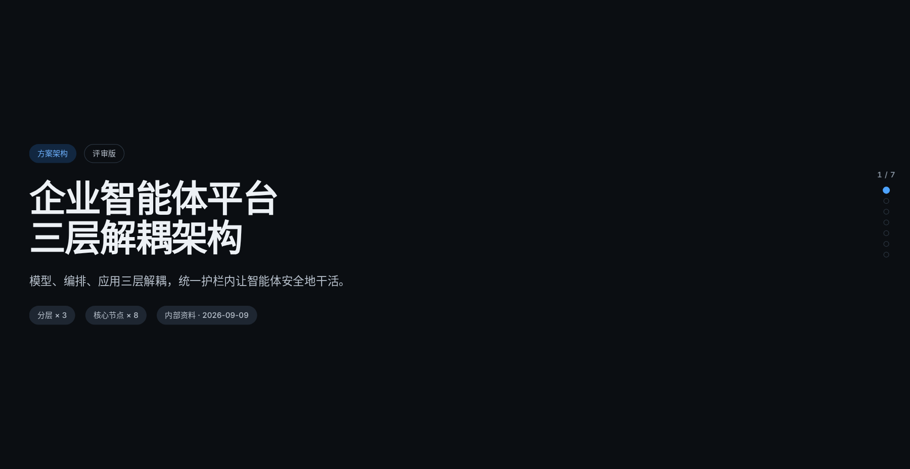
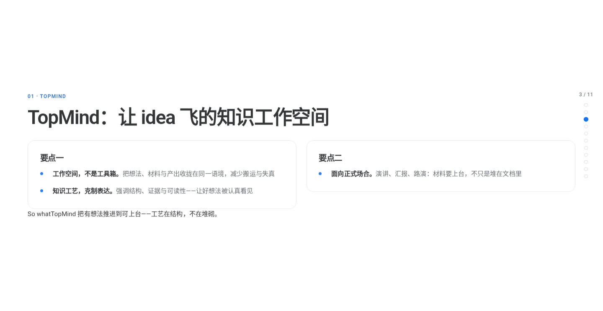
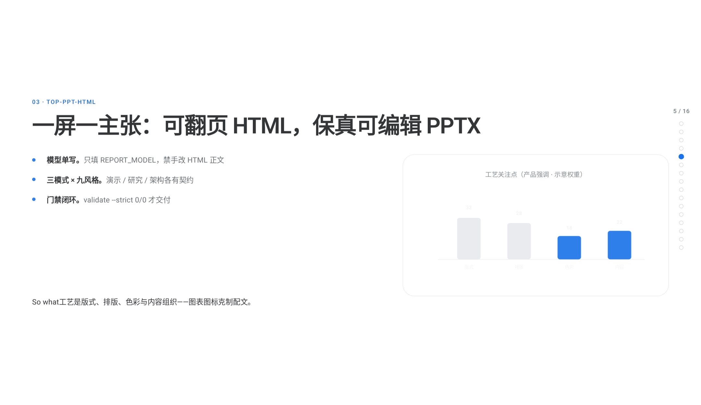
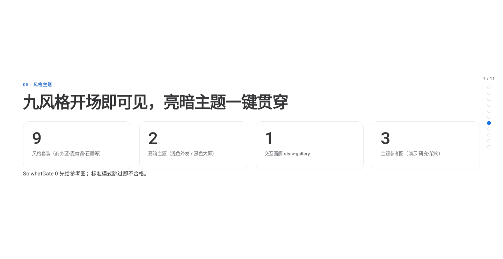
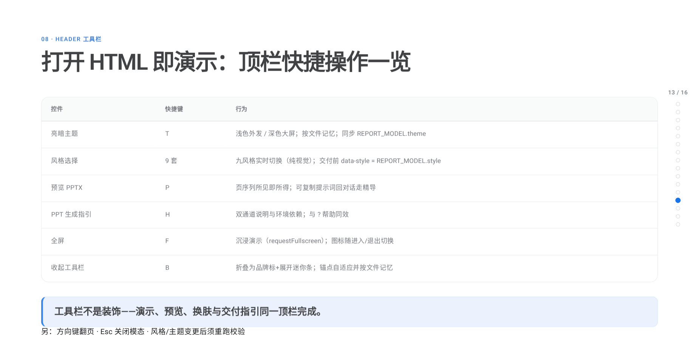

# tms-skills

**[中文](./README.md)** | English

> Language note: **Chinese is the default** (`README.md`). This file is the full English parallel.

[](https://github.com/topmindspace/tms-skills/releases)
[](https://www.npmjs.com/package/@topmindspace/tms-skills)
[](https://github.com/topmindspace/tms-skills/actions/workflows/ci.yml)
[](LICENSE)

**TopMindspace agent-skills monorepo** — formal business presentations, WeChat articles, X long-form posts, cover art: four skills, one repo.

### top-ppt-html · Formal business presentations

Built for **demo reports / formal business decks**: **HTML + PPT dual delivery**. Day-to-day, present with single-file HTML like slides; export **high-fidelity editable PPTX** when needed (charts carry data you can annotate). MD3-inspired: fitting information density, restrained type / shapes / color. Formal business presenting — not decoration.

```bash
npx @topmindspace/tms-skills install top-ppt-html
```

### topmind-wechat-post · WeChat article authoring

Full lifecycle for WeChat articles: delivery package, review & rewrite, three quality gates (facts / logic / de-AI-flavor), WeChat inline typography (images must be embedded), publish checklist and status sync. Python stdlib only — zero dependencies.

```bash
npx @topmindspace/tms-skills install topmind-wechat-post
```

### topmind-x-article · One-click X long-form publishing

Markdown draft → paste-ready plain text (`md2x.py` adapts to the X Article editor: images → `[图N]`, tables → "item: value" lists) + cover art + publish checklist. Publishing is done by hand-pasting; fetch the text back for verification after posting.

```bash
npx @topmindspace/tms-skills install topmind-x-article
```

### topmind-cover · Cover art generation

Shared cover art for X long-form and WeChat: striking, eye-catching, theme-focused. Built-in **6-style cover style library** (bold poster / futuristic tech / editorial magazine / minimalist / guochao illustration / cyber glitch art — each with use cases, hex palettes, font suggestions, Chinese+English prompt recipes) + **12 dual-size example images** (`assets/examples/`, shipped with the package): **pick a style → check the example → compose the prompt from the recipe**, then one-click crop to both platform sizes with `crop-cover.py` (X 1200×675, WeChat 900×383).

```bash
npx @topmindspace/tms-skills install topmind-cover
```

> Let ideas fly — make good thinking visible.

<p align="center">
  
</p>

> **Warning**: do not install `@topmindspace/tms-skills@^2` (2.0.0–2.1.1 deprecated). Current line is **0.2.x** (`latest`).

## Craft at a glance

### Theme overview (Gate 0)

<p align="center">
  <br/>
  <sub>Presentation · business-blue (default) · also <a href="./top-ppt-html/assets/style-gallery.html">style-gallery</a> · <a href="./top-ppt-html/assets/theme-overview-research.png">research overview</a> · <a href="./top-ppt-html/assets/theme-overview-architecture.png">architecture overview</a></sub>
</p>

### Style covers

| Presentation · business-blue | Research · mckinsey | Architecture · graphite-dark |
|:---:|:---:|:---:|
|  |  |  |

### Product showcase (Mode A · dual-delivery narrative · multi-chart · header toolbar)

| Positioning | Dual delivery | Charts | Header toolbar |
|:---:|:---:|:---:|:---:|
|  |  |  |  |

**Live**

- Landing: [topmindspace.github.io/tms-skills/](https://topmindspace.github.io/tms-skills/)
- Full deck: [showcase.html](https://topmindspace.github.io/tms-skills/showcase.html)
- Style gallery: [style-gallery.html](https://topmindspace.github.io/tms-skills/style-gallery.html)
- In-repo gallery: [top-ppt-html/assets/style-gallery.html](./top-ppt-html/assets/style-gallery.html)
- Showcase HTML: [top-ppt-html/assets/examples/2026-09-26-topmind-tms-skills-showcase.html](./top-ppt-html/assets/examples/2026-09-26-topmind-tms-skills-showcase.html)
- More shots: [docs/showcase/](./docs/showcase/)

### HTML header toolbar (ready when you open the file)

| Control | Shortcut | Behavior |
|---------|----------|----------|
| Theme toggle | **T** | Light / dark; per-file memory; syncs `REPORT_MODEL.theme` |
| Style picker | 9 styles | Live visual skins; write back `REPORT_MODEL.style` before deliver |
| PPTX preview | **P** | WYSIWYG page sequence + copyable agent prompt |
| Generation guide | **H** | Dual-channel + environment notes |
| Fullscreen | **F** | Immersive present mode |
| Collapse toolbar | **B** | Mini bar (brand + expand); remembers per file |

See [top-ppt-html/README.md](./top-ppt-html/README.md#html-header-toolbar) and [SKILL.md](./top-ppt-html/SKILL.md).

## Skills

| Skill | Version | What it does |
|-------|---------|--------------|
| [`top-ppt-html`](./top-ppt-html/) | **0.1.19** | Formal business decks: paginated HTML + editable 16:9 PPTX; dual delivery · MD3-inspired density; 3 modes × 9 styles; strict 0/0 |
| [`topmind-wechat-post`](./topmind-wechat-post/) | **0.1.0** | WeChat article lifecycle: package, review, 3 quality gates, inline typography & publish checklist |
| [`topmind-x-article`](./topmind-x-article/) | **0.1.0** | X long-form one-click publish: Markdown → paste-ready plain text + cover + checklist |
| [`topmind-cover`](./topmind-cover/) | **0.1.0** | Cover art for X / WeChat: striking, theme-focused; 6-style cover style library + 12 dual-size example images, size specs + crop tooling |

Installer [`@topmindspace/tms-skills`](https://www.npmjs.com/package/@topmindspace/tms-skills) is **0.3.0** (whole-repo same-tag releases).

### topmind-cover · Cover style library

| Style | In one line | Typical topics |
|-------|-------------|----------------|
| Bold poster `big-poster` | One-sentence stance, maximum impact | Opinion pieces, hot takes |
| Futuristic tech `tech-future` | Neon blue / electric violet on deep navy | AI / LLMs / agents |
| Editorial magazine `magazine` | Restrained, premium, trustworthy | In-depth interviews, profiles |
| Minimalist `minimal` | Vast negative space, room to breathe | Essays, book reviews, light takes |
| Guochao illustration `guochao` | Vermilion / dark teal / gold, cultural punch | Trad culture, festivals, heritage |
| Cyber glitch art `cyber-glitch` | RGB channel-split, digital-decay aesthetic | Net culture, cyberpunk |

**Three steps to a cover**: ① pick 1 of 6 styles by topic → ② check the matching example in [`topmind-cover/assets/examples/`](./topmind-cover/assets/examples/) → ③ compose the prompt from that style's recipe in [`references/cover-styles.md`](./topmind-cover/references/cover-styles.md). 12 example images (6 styles × 1200×675 master + 900×383 WeChat center-crop, ~6.4MB) ship with the npm package; **safe-zone rule**: title text and key subject must stay inside the central vertical 60% safe zone.

## Install

**npm = pinned snapshot**; **GitHub = track repo HEAD**.

```bash
npx @topmindspace/tms-skills list
npx @topmindspace/tms-skills install top-ppt-html
npx @topmindspace/tms-skills install top-ppt-html --to ./.claude/skills
npx @topmindspace/tms-skills@0.3.0 install top-ppt-html   # pin
```

```bash
# track HEAD
npx github:topmindspace/tms-skills install top-ppt-html
```

Default probe order: `./.agents` → `./.claude` → `./.cursor` → `./.codex` → `./.mimocode`, then user-level `~/.claude`, etc. Or pass `--to`. Do not `npm install top-ppt-html` (skill id is not a standalone package).

PPTX export needs `npm install` in the skill folder (pptxgenjs). HTML generation uses Python stdlib only.

## Golden examples

| Mode | File |
|------|------|
| A Presentation | [`2026-09-09-presentation-business-blue`](./top-ppt-html/assets/examples/2026-09-09-presentation-business-blue.html) |
| B Research | [`2026-09-09-research-mckinsey`](./top-ppt-html/assets/examples/2026-09-09-research-mckinsey.html) |
| C Architecture | [`2026-09-09-architecture-graphite-dark`](./top-ppt-html/assets/examples/2026-09-09-architecture-graphite-dark.html) |
| Product showcase | [`2026-09-26-topmind-tms-skills-showcase`](./top-ppt-html/assets/examples/2026-09-26-topmind-tms-skills-showcase.html) (dual-delivery narrative · 5 chart types · toolbar page) |

## Repo layout

```
tms-skills/
├─ top-ppt-html/             # skill (SKILL.md + assets + references + scripts)
├─ bin/tms-skills.js         # CLI: list / install
├─ docs/                     # publishing · showcase shots · banner · Pages source
├─ scripts/                  # repo gates / privacy scan
├─ package.json              # @topmindspace/tms-skills
└─ LICENSE · CHANGELOG.md · README.md · README.en.md
```

## Release & CI

| Action | GitHub | npm |
|--------|:------:|:---:|
| push main | live | **unchanged** |
| tag `vX.Y.Z` | Release + zip | **auto publish** |

```bash
npm run check && npm run audit && npm run privacy
# PPTX smoke (incl. McKinsey): bash scripts/ci_skill_gates.sh --with-pptx
```

See [docs/PUBLISHING.md](./docs/PUBLISHING.md) · [docs/ci.md](./docs/ci.md).

## License

MIT © TopMindspace — [LICENSE](./LICENSE)
