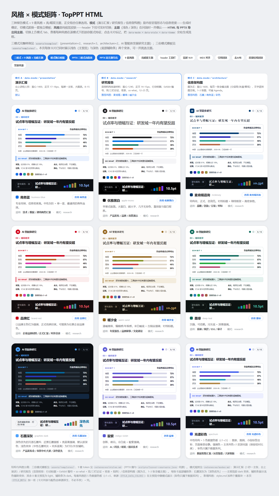
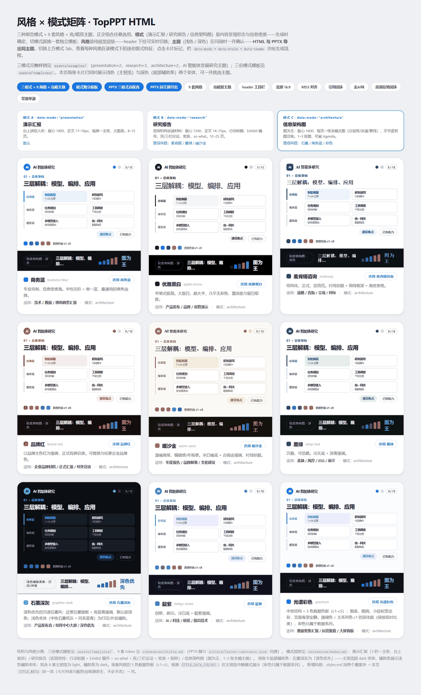
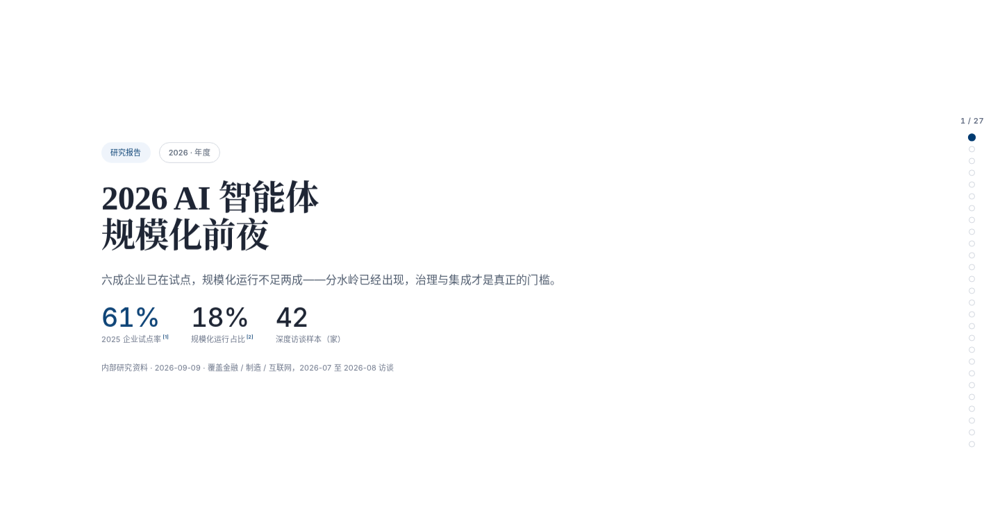
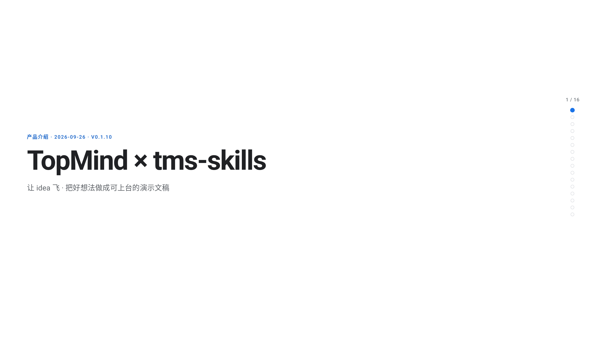
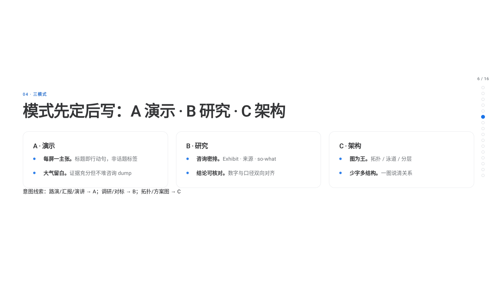
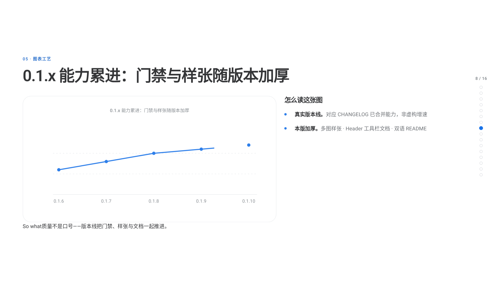

# tms-skills

[](https://github.com/topmindspace/tms-skills/releases)
[](https://www.npmjs.com/package/@topmindspace/tms-skills)
[](https://github.com/topmindspace/tms-skills/actions/workflows/ci.yml)
[](LICENSE)

**TopMindspace 智能体技能 monorepo** — 把好想法做成可上台的交付。

当前主技能 **[top-ppt-html](./top-ppt-html/)**：优雅、大气的正式场合**演示文稿**（单文件 HTML + 版式保真可编辑 PPTX）。

> 让 idea 飞，好想法被看见。

<p align="center">
  
</p>

> **警告**：不要安装 `@topmindspace/tms-skills@^2`（2.0.0–2.1.1 已弃用）。当前线 **0.1.x**（`latest`）。

## 一眼看到工艺

### 主题总览（Gate 0）

<p align="center">
  <br/>
  <sub>演示 · business-blue</sub>
</p>

<p align="center">
  <br/>
  <sub>研究 · mckinsey</sub>
</p>

<p align="center">
  <br/>
  <sub>架构 · graphite-dark</sub>
</p>

### 风格封面

| 演示 · business-blue | 研究 · mckinsey | 架构 · graphite-dark |
|:---:|:---:|:---:|
|  |  |  |

### 产品 Showcase 样张（Mode A · ~10 页）

| Cover | 三模式 | 质量门禁 |
|:---:|:---:|:---:|
|  |  |  |

**在线体验**

- 落地页：[topmindspace.github.io/tms-skills/](https://topmindspace.github.io/tms-skills/)
- 完整演示文稿：[showcase.html](https://topmindspace.github.io/tms-skills/showcase.html)
- 风格画廊：[style-gallery.html](https://topmindspace.github.io/tms-skills/style-gallery.html)
- 仓库内交互画廊：[top-ppt-html/assets/style-gallery.html](./top-ppt-html/assets/style-gallery.html)
- 仓库内 Showcase HTML：[top-ppt-html/assets/examples/2026-09-26-topmind-tms-skills-showcase.html](./top-ppt-html/assets/examples/2026-09-26-topmind-tms-skills-showcase.html)
- 更多截图：[docs/showcase/](./docs/showcase/)

## 技能一览

| 技能 | 版本 | 做什么 |
|------|------|--------|
| [`top-ppt-html`](./top-ppt-html/) | **0.1.9** | 正式场合演讲/汇报演示文稿：HTML 可翻页 + 16:9 可编辑 PPTX；三模式 × 九风格；strict 0/0 门禁 |

安装器 [`@topmindspace/tms-skills`](https://www.npmjs.com/package/@topmindspace/tms-skills) 同为 **0.1.9**（整仓同 tag 发版）。

## 安装

**npm = 钉版本快照**；**GitHub = 跟仓库 HEAD**。

```bash
npx @topmindspace/tms-skills list
npx @topmindspace/tms-skills install top-ppt-html
npx @topmindspace/tms-skills install top-ppt-html --to ./.claude/skills
npx @topmindspace/tms-skills@0.1.9 install top-ppt-html   # 钉版本
```

```bash
# 跟 HEAD
npx github:topmindspace/tms-skills install top-ppt-html
```

默认探测：`./.agents` → `./.claude` → `./.cursor` → `./.codex` → `./.mimocode`，再用户级 `~/.claude` 等；也可用 `--to`。不要 `npm install top-ppt-html`（技能 id 不是独立包）。

PPTX 精导需在技能目录 `npm install`（pptxgenjs）。HTML 生成仅 Python 标准库。

## 黄金样张

| 模式 | 文件 |
|------|------|
| A 演示 | [`2026-09-09-presentation-business-blue`](./top-ppt-html/assets/examples/2026-09-09-presentation-business-blue.html) |
| B 研究 | [`2026-09-09-research-mckinsey`](./top-ppt-html/assets/examples/2026-09-09-research-mckinsey.html) |
| C 架构 | [`2026-09-09-architecture-graphite-dark`](./top-ppt-html/assets/examples/2026-09-09-architecture-graphite-dark.html) |
| 产品 Showcase | [`2026-09-26-topmind-tms-skills-showcase`](./top-ppt-html/assets/examples/2026-09-26-topmind-tms-skills-showcase.html) |

## 仓库结构

```
tms-skills/
├─ top-ppt-html/             # 技能（SKILL.md + assets + references + scripts）
├─ bin/tms-skills.js         # CLI：list / install
├─ docs/                     # 发布规范 · showcase 截图 · banner
├─ scripts/                  # 仓库级门禁 / 隐私扫描
├─ package.json              # @topmindspace/tms-skills
└─ LICENSE · CHANGELOG.md · README.md
```

## 发布与 CI

| 动作 | GitHub | npm |
|------|:------:|:---:|
| push main | 立即可见 | **不变** |
| tag `vX.Y.Z` | Release + zip | **自动 publish** |

```bash
npm run check && npm run audit && npm run privacy
# PPTX 冒烟（含 McKinsey）：bash scripts/ci_skill_gates.sh --with-pptx
```

详见 [docs/PUBLISHING.md](./docs/PUBLISHING.md) · [docs/ci.md](./docs/ci.md)。

## 许可证

MIT © TopMindspace — [LICENSE](./LICENSE)
