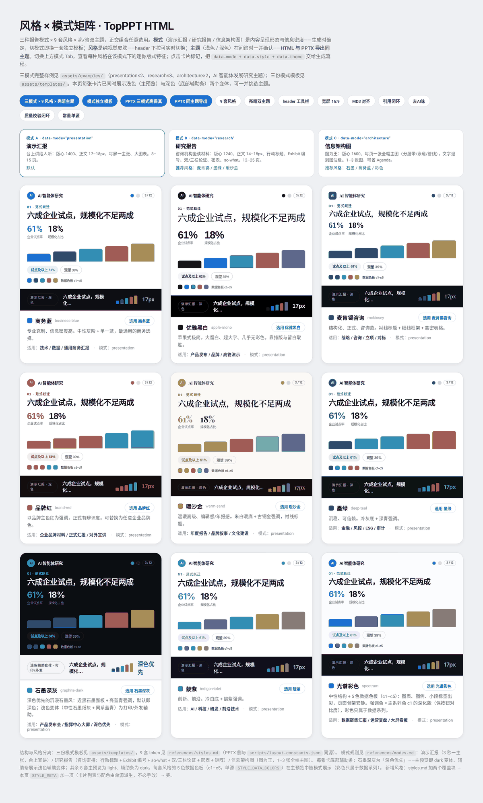
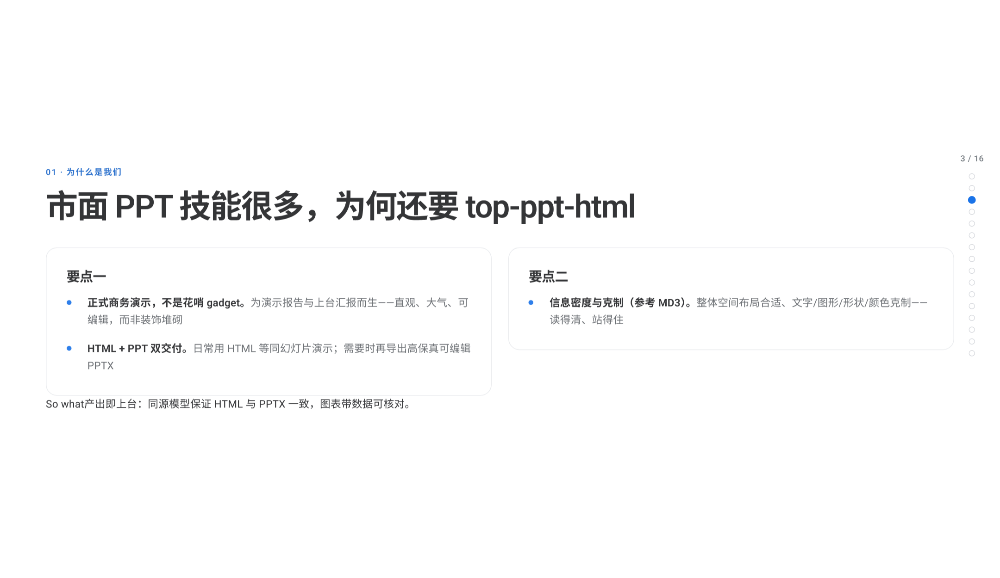
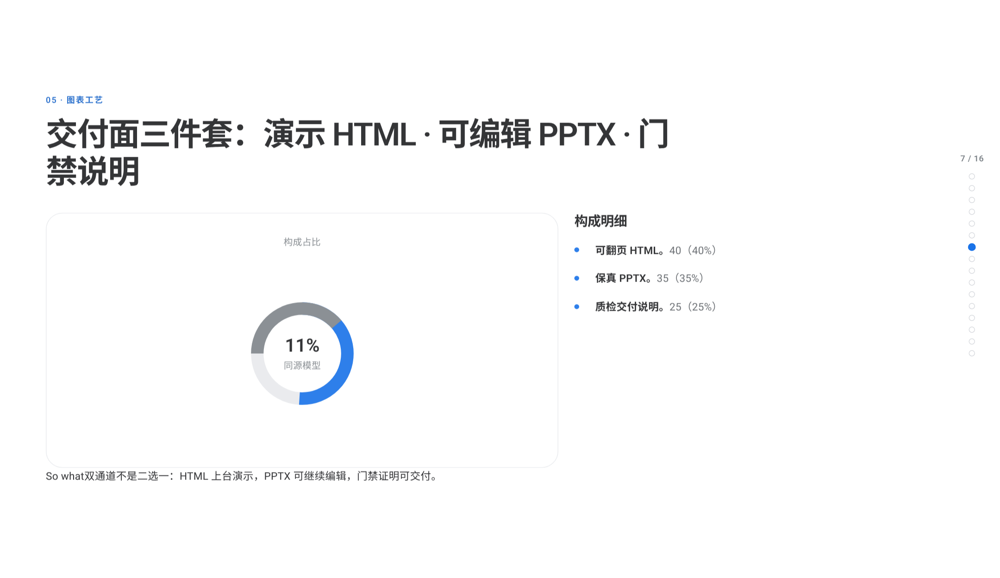
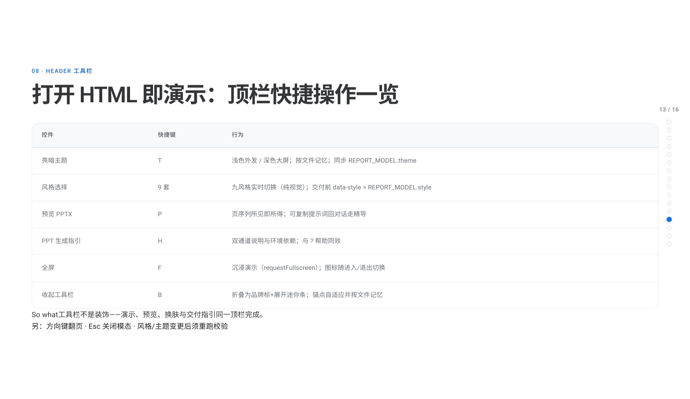

# TopPPT HTML

**[中文](./README.md)** | English

[](https://github.com/topmindspace/tms-skills/releases)
[](https://www.npmjs.com/package/@topmindspace/tms-skills)
[](https://github.com/topmindspace/tms-skills/actions/workflows/ci.yml)
[](../LICENSE)

**Let ideas fly — make good thinking visible.** A high-craft skill for **demo reports / formal business presentations**: **HTML + PPT dual delivery** — day-to-day, present with paginated HTML like slides; export **layout-faithful editable PPTX** when needed. **MD3-inspired**: fitting information density, restrained type / shapes / color. Core craft is layout, typography, color, and content structure — not gadget soup.

### Why top-ppt-html

Plenty of PPT skills exist. This one is for **formal business presenting**: clear, atmospheric, multi-style, **high-fidelity editable PPTX** (charts carry annotatable data) — stage-ready output.

<p align="center">
  
</p>

- Skill id: `top-ppt-html`; brand: **TopPPT HTML**
- Version: **v0.1.11** (same tag as `@topmindspace/tms-skills@0.1.11`)
- **Agent entry**: `SKILL.md` → `references/playbook.md` (L1) → L2 on demand
- **Human maintainers**: this README (install / commands / layout); do not treat it as the generation spec

### Theme overview (Gate 0)

<p align="center">
  <br/>
  <sub>Presentation · business-blue (default) · also <a href="./assets/style-gallery.html">style-gallery</a> · <a href="./assets/theme-overview-research.png">research</a> · <a href="./assets/theme-overview-architecture.png">architecture</a></sub>
</p>

### Style × mode

| business-blue · Presentation | mckinsey · Research | graphite-dark · Architecture |
|:---:|:---:|:---:|
|  |  |  |

| Positioning | Dual delivery | Charts | Header toolbar |
|:---:|:---:|:---:|:---:|
|  |  |  |  |

**Live** · [Landing](https://topmindspace.github.io/tms-skills/) · [Showcase deck](https://topmindspace.github.io/tms-skills/showcase.html) · [Style gallery](https://topmindspace.github.io/tms-skills/style-gallery.html)

- In-repo gallery: [`assets/style-gallery.html`](./assets/style-gallery.html)
- Product showcase: [`assets/examples/2026-09-26-topmind-tms-skills-showcase.html`](./assets/examples/2026-09-26-topmind-tms-skills-showcase.html) (Mode A · dual-delivery narrative · **5 chart types** · toolbar page)
- Repo shot pack: [`docs/showcase/`](../docs/showcase/)

## Skill snapshot

| Dimension | Capability |
|-----------|------------|
| Output | Single-file HTML (paginated, light/dark, **header toolbar T/P/H/F/B + 9 styles**) + 16:9 editable PPTX |
| Positioning | Formal business · dual delivery · MD3-inspired density |
| Modes | A Presentation · B Research · C Architecture |
| Styles | 9 packs (`styles.md`) |
| Charts | Core 8 by default + full registry; variety / anti-truncation / Mode A craft |
| Quality | `validate_report --strict` · `validate_pptx --strict` · `quality_gate --deliver` |

## HTML header toolbar

| Control | Shortcut | Behavior |
|---------|----------|----------|
| Theme toggle | **T** | Light / dark; per-file memory; syncs `REPORT_MODEL.theme` |
| Style picker | 9 styles | Live visual skins; write back `REPORT_MODEL.style` before deliver |
| PPTX preview | **P** | WYSIWYG sequence + copyable agent prompt |
| Generation guide | **H** | Dual-channel + environment notes |
| Fullscreen | **F** | Immersive present |
| Collapse toolbar | **B** | Mini bar; remembers per file |

Also: arrow-key paging; **Esc** closes modals. After style/theme change, re-run `validate_report --strict` (do not rewrite content).

## Install

```bash
npx @topmindspace/tms-skills install top-ppt-html
npx @topmindspace/tms-skills@0.1.11 install top-ppt-html
npx github:topmindspace/tms-skills install top-ppt-html
```

PPTX needs `npm install` in this folder (pptxgenjs). HTML generation: Python stdlib only.

Full Chinese maintainer docs (directory map, command cookbook): see [`README.md`](./README.md). Agent rules live in `SKILL.md` / `playbook.md`.
