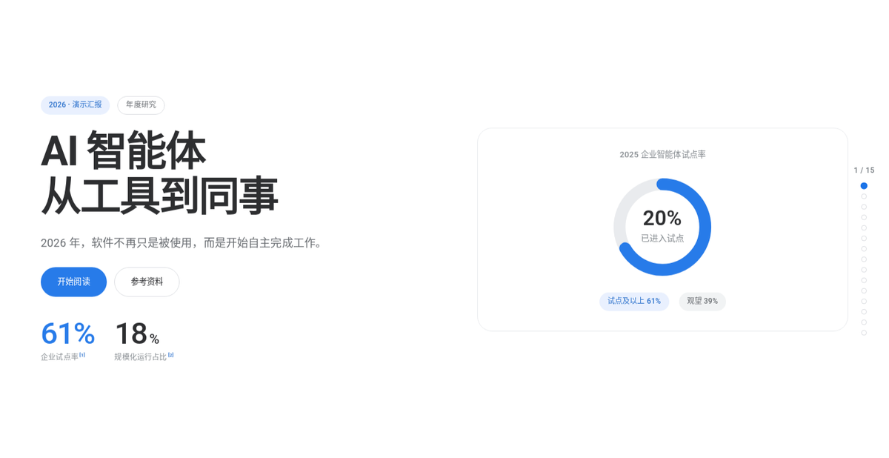
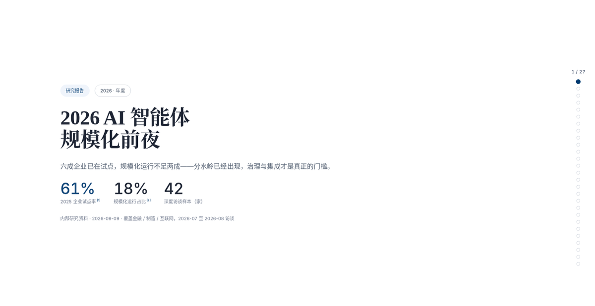
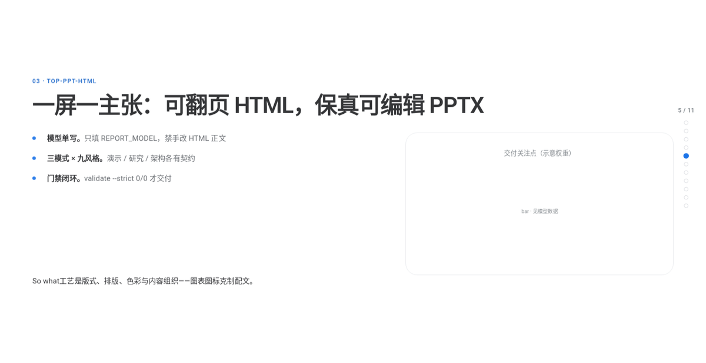
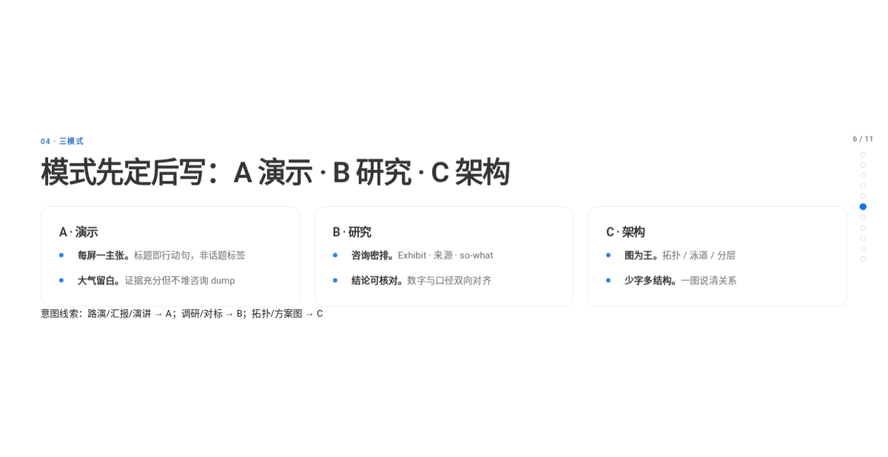
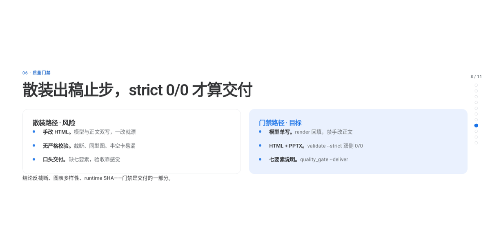

# TopPPT HTML

<p align="center">
  
</p>

**让 idea 飞，好想法被看见。** 面向**演讲与正式场合**的高品质演示文稿技能：把主张、调研、分析、架构方案，生成为**优雅、美观、大气**的可翻页 HTML + **版式保真可编辑 PPTX**。核心工艺是版式、排版、色彩与内容组织——克制图标/图表配文，而非 gadget 堆砌或咨询 dump 默认。

- 技能标识：`top-ppt-html`；品牌名：**TopPPT HTML**
- 版本：**v0.1.8**（与 `@topmindspace/tms-skills@0.1.8` 同 tag）
- **智能体入口**：`SKILL.md` → `references/playbook.md`（L1）→ L2 按需
- **人类维护者**：本 README（安装 / 命令 / 目录）；勿把本文件当生成规范

### 风格 × 模式一览

| business-blue · 演示 | mckinsey · 研究 | graphite-dark · 架构 |
|:---:|:---:|:---:|
|  |  |  |

| Showcase · HTML+PPTX | 三模式 | 质量门禁 |
|:---:|:---:|:---:|
|  |  |  |

- 交互画廊：[`assets/style-gallery.html`](./assets/style-gallery.html)
- 产品 Showcase：[`assets/examples/2026-09-26-topmind-tms-skills-showcase.html`](./assets/examples/2026-09-26-topmind-tms-skills-showcase.html)（Mode A · business-blue · ~10 页）
- 主题参考图（Gate 0）：`assets/theme-overview*.png`
- 仓库级大图集：[`docs/showcase/`](../docs/showcase/)（不进技能 zip）

## 一、技能简介（人类速览）
| 维度 | 能力 |
|------|------|
| 产出 | 单文件 HTML（可翻页、亮暗双主题、header 工具栏）+ 16:9 可编辑 PPTX（精导通道） |
| 三模式 | A 演示 · B 研究 · C 架构（页型/字号/密度契约见 `playbook.md` §一） |
| 风格 | 9 套（`styles.md`）；编码色板 c1–c5 随风格 |
| 图表 | 核图 8 默认 + registry 全量；多样性 / 反截断 / Mode A 工艺见 playbook + `presentation-craft.md` |
| 质量 | `validate_report --strict`（A 隐含 layout-qa）· `validate_pptx --strict` · `quality_gate --deliver` |

生成规范、页型/图表穷举、铁律 **不在本文件**——智能体读 `SKILL.md` / playbook；选型大表见 `page-type-matrix.md` / `chart-decision-tree.md`。

**核心架构**：HTML 与 PPTX 出自同一内容模型 `window.REPORT_MODEL`（唯一事实源）；页面只预览不导出，PPTX 由智能体走「精导通道」生成（extract → build → strict 校验）。阈值与几何全部单源化：`scripts/layout-constants.json`（常量）+ `scripts/model-schema.json`（页型 DSL）。

## 二、安装与使用

### 安装

本技能是 [`tms-skills`](https://github.com/topmindspace/tms-skills) monorepo 中的一个技能包（路径 `top-ppt-html/`）。npm 安装器已发布：[`@topmindspace/tms-skills`](https://www.npmjs.com/package/@topmindspace/tms-skills)。

```bash
# 推荐 · npm
npx @topmindspace/tms-skills install top-ppt-html
# 或指定目录
npx @topmindspace/tms-skills install top-ppt-html --to ./.agents/skills

# 跟仓库 HEAD · GitHub 直装
npx github:topmindspace/tms-skills install top-ppt-html

# clone 后本地安装
git clone https://github.com/topmindspace/tms-skills.git
node tms-skills/bin/tms-skills.js install top-ppt-html
```

> **GitHub 更新不会自动进 npm。** 日常可钉 npm 版本；要最新技能用 GitHub 直装，或等 maintainer 打 tag 发版。
>

### 触发词回归（维护者）

```bash
python3 scripts/check_triggers.py          # keyword/heuristic vs SKILL description
# 扩展：编辑 evals/trigger-queries.json（how_to_extend）
```

`package_skill.py --check` 会自动跑 trigger coverage。

> 「找不到这个包」→ 换 GitHub 直装，或 `--registry https://registry.npmjs.org/`（镜像索引可能滞后）。不要 `npm install top-ppt-html`（技能 id 不是独立 npm 包）。

也可将本目录（或 GitHub Release 附件 `top-ppt-html.zip` 解压结果）复制到智能体技能目录，目录名保持 `top-ppt-html`。技能识别面为 `SKILL.md`（frontmatter 的 `name` / `description` 即触发描述）。

**依赖**：HTML 生成与全部校验脚本零第三方依赖（Python 标准库）。只有「生成 PPTX」需要 Node + pptxgenjs：

```bash
cd top-ppt-html
npm install                  # 依 package.json 安装 pptxgenjs（^4）
# 或：npm install pptxgenjs ／ 把 NODE_PATH 指向任意已含 pptxgenjs 的 node_modules
```

脚本会自动探测 Node 与 node_modules（`TOP_PPT_NODE_EXE` / `TOP_PPT_NODE_PATH` 环境变量 > `PATH` > 常见托管目录），不绑定任何机器的固定路径。参考图刷新（可选，非交付依赖）另需 playwright：`npm install playwright && npx playwright install chromium`。

### 用户视角（三步走）

1. 对智能体说出意图（例：「帮我把这份调研做成一份咨询风格的研究报告」）
2. 回答一次**六项问询**（全部带推荐，不选即按推荐走）：①模式 ②篇幅 ③风格 ④亮暗主题 ⑤交付格式（仅 HTML / HTML+PPTX）⑥参考图
3. 收到交付：HTML 落到指定输出目录（默认当前工作目录）；需要 PPTX 时智能体走精导通道一并生成——或事后打开报告页面点「预览 PPTX」复制提示词回对话补生成

### 智能体视角（工作流）

```
听意图 → Gate 0 参考图 → 六项问询 → 路径判定（轻量默认 / 完整走 outline-design.md 七步法）
→ scaffold_report.py 起骨架（勿整读/复制模板）→ **只填 window.REPORT_MODEL** → `render_from_model.py --inplace`
→ validate_report.py --strict 全 PASS → 交付（默认 HTML）
→（用户要 PPTX 时 · **仅 B 通道**）extract_model.py → build_pptx.js --model → validate_pptx.py --strict 0/0
```

**渐进式披露三档**（详见 `SKILL.md` 阶段路由表）：`L0` = `SKILL.md`（路由 + 门禁 + 铁律，加载即用）；`L1` = `references/playbook.md`（**唯一常读入口**：模式契约 / 页型选型 / 组合版式矩阵 / 图表选型决策树 / 内容规则 / 配色 / 校验命令）；`L2` = 深度规范，**只在命中条件时读、读完即停**；**取码必须 `extract_snippet.py`**（整读大 L2 = FAIL）；`components.md`/`charts.md` 为逻辑索引，自动路由到物理拆分文件。

## 三、目录结构

```
top-ppt-html/
├─ SKILL.md                     # 智能体入口：触发描述 + 工作流 + 铁律        ┐
├─ README.md                    # 本文件：人类视角的简介/开发/打包           │
├─ package.json                 # Node 依赖（pptxgenjs）与常用命令            │ 进包
├─ assets/                      #                                           │ 且
│  ├─ templates/                #   三份模式模板（presentation/research/architecture）  │ 入库
│  │                            #   + engine.css / ui.js（公共引擎/UI，sync_runtime 注入源）
│  ├─ examples/                 #   3 黄金样张 + showcase（HTML+model）                          │
│  ├─ pptx-export.js            #   PPTX 预览运行时（含常量/schema 注入块）   │
│  ├─ style-gallery.html        #   风格 × 模式 × 亮暗主题交互画廊            │
│  ├─ theme-overview*.png       #   3 张主题参考图（整体=演示 / 研究 / 架构）  │
│  └─ showcase/                 #   README 用精简截图（完整集见 docs/showcase） │
├─ references/                  # 规范（L1 常读 1 篇 + L2 按需；components/charts 已按族拆分）│  ├─ playbook.md               #   ★ L1 唯一常读入口：模式/页型/组合/图表/配色/校验 │
│  ├─ components.md             #   逻辑索引（§ 路由到下列物理文件）              │
│  ├─ components-atoms.md       #   §1–§15c 结构组件                              │
│  ├─ layouts-research.md       #   §36–§36f research 锁定版式                    │
│  ├─ layouts-architecture.md   #   §37–§38b architecture 版式                    │
│  ├─ layouts-combo.md          #   §32–§34/§39–§50 组合与选型表 §46              │
│  ├─ charts.md                 #   逻辑索引（图表 § 路由）                       │
│  ├─ charts-basic.md           #   §16–§35 基础图表代码                          │
│  ├─ charts-extended.md        #   §52–§70 advanced（意图命中才读，禁预读）        │
│  ├─ charts-discipline.md      #   §64/§66 误用与多样性纪律                      │
│  ├─ infographics.md           #   铁律与边界（逻辑入口）；代码已拆分见下两行          │
│  ├─ infographics-stats.md     #   统计图形族 §1–§6 / §71–§77                        │
│  ├─ infographics-structure.md #   结构图形族 §78–§82                                │
│  ├─ page-type-matrix.md     #   L2 意图→页型穷举（playbook §三 速记）                 │
│  ├─ chart-decision-tree.md  #   L2 图表决策表+误用（playbook §五 摘要）               │
│  ├─ illustration-layout.md  #   L2 插画/配图 brief                                   │
│  └─ …（modes / styles / design-system / content-rules / icons / default-surface /     │
│        outline-design / pptx-export / high-fidelity / failure-modes / tech-design；  │
│        归档见 docs/archive/refs/）                                                   │
├─ evals/                       # Eval 框架（结果/过程/风格/效率四类目标）    │
│  ├─ prompts.csv               #   14 条 prompt（显式/隐式/上下文/负对照）   │
│  ├─ rubric.schema.json        #   风格目标结构化评分契约                    │
│  ├─ run_evals.py              #   确定性检查 + 效率度量 + rubric 落地       │
│  └─ trace.example.json        #   过程/效率 trace 示例（轮次/工具调用/读取量）│
├─ scripts/                     # 生成/校验/回归/维护工具（见下表）          ┘
├─ .gitignore                   # 出库规则（dist/依赖/缓存/本地状态/临时脚本）
├─ dist/                        # 构建与回归产物 + 分发包 zip + 发布清单  ← 不进包、不入库
└─ （本地状态目录）                      # IDE / 智能体本地状态                  ← 不进包、不入库
```

---

## 常用命令（细节见 `references/playbook.md`）

```bash
# 标准 / Fast 共用链（模型单写）
python scripts/scaffold_report.py --mode research --style mckinsey --theme light \
  --title "标题" --sections 8 --out report.html
# 只填 window.REPORT_MODEL 后：
python scripts/render_from_model.py report.html --inplace
python scripts/validate_report.py report.html --strict --layout-qa
python scripts/quality_gate.py report.html --deliver

# 布局建议 / PPTX
python scripts/recommend_layout.py --mode B --intent "经营分析" --pages 10 --json
python scripts/extract_model.py report.html report.model.json
node scripts/build_pptx.js report.pptx --model=report.model.json
python scripts/validate_pptx.py report.pptx --strict --model=report.model.json
bash scripts/smoke_pptx.sh

# 门禁
python scripts/package_skill.py --check
python scripts/audit_skill.py && python scripts/audit_docs.py
python scripts/audit_styles.py && python scripts/audit_css.py
python scripts/negative_tests.py
python scripts/check_triggers.py
# 可选第三方：npx --yes skills-ref@0.1.5 validate .
```

## 目录要点

| 路径 | 用途 |
|------|------|
| `SKILL.md` | L0 路由（≤13KB）；智能体唯一入口 |
| `references/playbook.md` | L1 决策层（Mode / 路径 / V1–V4 / 组合 / 多样性摘要 / 命令 / 路由） |
| `references/page-type-matrix.md` | L2 页型穷举表 |
| `references/chart-decision-tree.md` | L2 图表决策树 + 七种误用 |
| `references/default-surface.md` | Mode A L1.5：12 页型 + 核图 8 + V1–V4 |
| `references/presentation-craft.md` | Mode A L1.5 工艺（反截断 / 大气正式） |
| `assets/examples/` | 3 份黄金样张（每模式 1）+ TopMind showcase |
| `evals/trigger-queries.json` | description 触发正/负例；`check_triggers.py` |
| `docs/archive/` | 历史规范 / 旧示例 |

风格画廊与主题参考图：`assets/theme-overview*.png`（Gate 0）。完整规范索引见 playbook §十。

